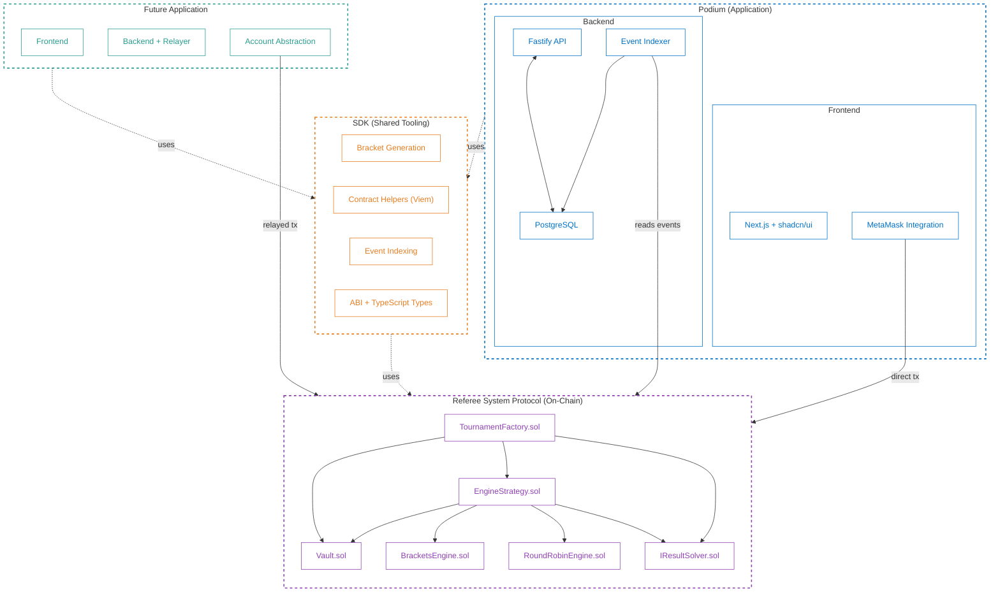

# Overview

The project follows a three-layer architecture that cleanly separates the trustless protocol from application infrastructure.

## Layers

### 1. Referee System Protocol (On-Chain)

The protocol is **exclusively on-chain** — a set of immutable smart contracts that are the sole source of truth for tournament state, prize custody, and result verification. This boundary is intentional: by keeping the protocol fully on-chain, we guarantee trustless finality with no off-chain dependencies.

- **Tournament Factory**: Instantiates isolated tournament environments.
- **Engine Strategies**: Modular contracts (Brackets, RoundRobin) that enforce specific tournament formats.
- **The Vault**: A secure, non-custodial contract that locks prize pools, releasing them only when cryptographic proof of a winner is provided.
- **Result Solvers**: An interface-based system (`IResultSolver`) that allows for pluggable verification methods — from human judges to automated Oracles.

The protocol works even if all backends and frontends go down. Any wallet can interact with the contracts directly.

### 2. SDK (Shared Tooling)

A TypeScript library that provides convenience utilities for applications building on the protocol. The SDK is **not** part of the protocol — it's tooling that reduces boilerplate.

- **Bracket generation**: Algorithms to build binary-tree brackets from participant lists.
- **Contract helpers**: Typed wrappers around contract interactions (via Viem).
- **Event indexing**: Utilities to parse and process on-chain events.
- **ABI + Types**: Auto-generated TypeScript types from contract ABIs.

Different applications can use the SDK or build their own integrations directly against the contracts.

### 3. Applications (Off-Chain)

Applications are the user-facing products built on top of the protocol, using the SDK. Each application owns its backend, database, and frontend — and can make its own technology and UX choices.

**Podium** is the first application:
- **Frontend** (Next.js + shadcn/ui): Bracket visualization, admin/judge actions, MetaMask integration.
- **Backend** (Fastify + Drizzle ORM + PostgreSQL): REST API, event indexer, tournament management.
- Users interact with the contracts directly from the frontend via MetaMask (for tournament creation and judge verdicts).
- The backend indexes on-chain events and provides a queryable API — it never submits on-chain transactions.

Future applications could take different approaches:
- A mobile app with embedded wallets and account abstraction.
- A Web2 platform with a backend relayer for gasless transactions.
- A CLI tool that interacts with the contracts directly.

## Diagram

