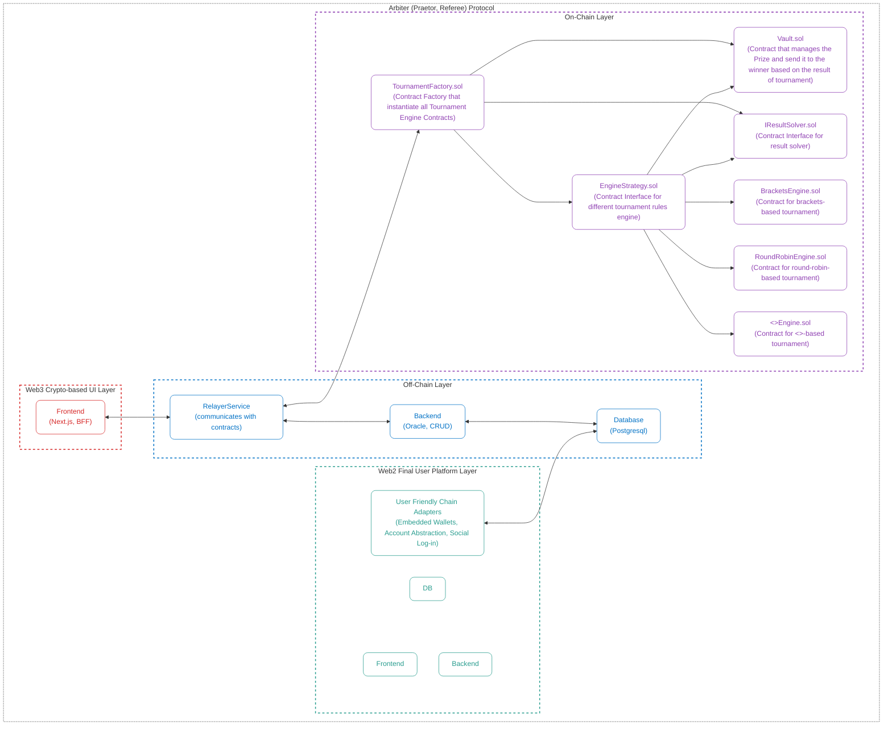

# Overview

The project is designed to separate the concerns of Referee System, which is the Web3 protocol, responsible for the core logic of the tournament including the rules, the prize management, and the result verification, on the chain - and the off-chain components, which are responsible for centralized services such as the Relayer Service, Oracle, the API Backend, and the Database. This separation allows for a more modular and scalable architecture, where the on-chain protocol can be developed and maintained independently of the off-chain services.

Regarding the final user platform, we have two options: a Web3 Crypto-based UI and a Web2 Final User Platform. The Web3 Crypto-based UI would be a decentralized application (dApp) that interacts directly with the on-chain protocol, allowing users to participate in tournaments using their crypto wallets. The Web2 Final User Platform, on the other hand, would be a more traditional web application that abstracts away the complexities of blockchain interactions, providing a more user-friendly experience for non-crypto users. This platform would interact with the off-chain services to facilitate tournament participation and management without requiring users to have direct blockchain knowledge or access.

## Diagram

